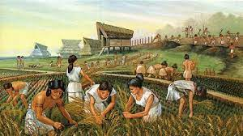
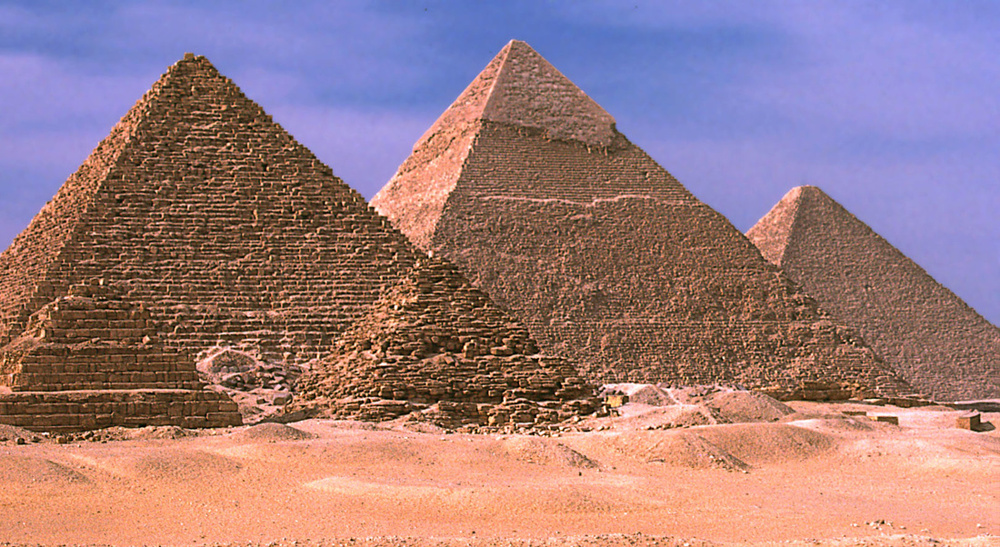

## Emergence of Ancient Civilizations

### Important Words

> :bulb: Try using the search bar to find these words. (Try the first letter of each word) or visit our [Glossary](../pages/glossary.md)

- ***Ancient*** - Belonging to the very distant past and or no longer in existence. *(Old)*

- ***Civilizations*** - The process by which a society or place reaches an advanced stage of social and cultural development and organization.

- ***Community*** - a group of people living in the same place or having a particular characteristic in common

- ***Civilized*** - being at an advanced stage of social and cultural development.

- ***Emergence*** - the process of coming into existence or prominence.

-  ***Sedentary*** - The practice of living in one place for a long time.

## Rivers and The Civilizations they helped to form

- ***River Nile*** - Ancient Egypt
- ***Tigris & Euphrates River*** - Messopotamia (LAND BETWEEN TWO RIVERS)
- ***Huang He (Yellow River) & Yangtze River*** - Ancient China
- ***Indus River*** - Ancient India

## Features of a Civilization

> :bulb: The Following words may not be found in the glossary. So please keep up with the definitions provided

- ***Cities*** - A large permanent human settlement   &emsp;  

- ***Sustainable Agriculture*** - This is where persons have now moved from hunting and gathering to rearing/domesticating animals which continue to reproduce.
Various crops are planted.   &emsp;  

- ***Organized Government/Social Classes*** - A civilization has a body that makes rules and maintain order within the society. People of the society are ranked according to authority and status.   &emsp; 

- ***Religon*** - Common beliefs are shared, rituals are performed and ceremonies held.   &emsp; 

- ***Specialized Jobs*** - Apart from hunting and farming, persons contribute to the society in other ways. E.g. Masonry, pottery, weaving etc.   &emsp;  

- ***Arts and Architecture*** - here are more complex structures and arts.   &emsp;  

## Quizziz

[Ancient Civilizations](https://quizizz.com/join/quiz/6341b3fb1d7d42001d915f8e/start?studentShare=truehttps://quizizz.com/join/quiz/6341b3fb1d7d42001d915f8e/start?studentShare=true ':include :type=iframe width=100% height=500px')